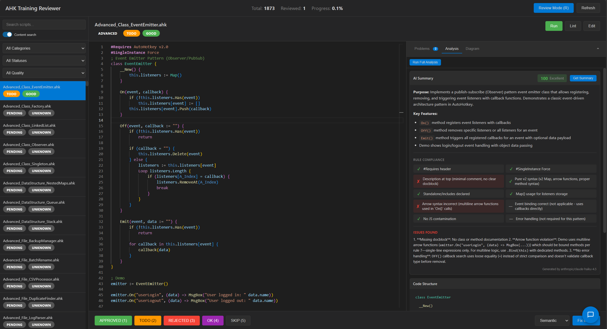

<div align="center">
  <h1>AHK Finetune</h1>
  <p>
    <strong>AutoHotkey v2 Training Data & Review Infrastructure</strong>
  </p>
  <p>
    <a href="#web-reviewer"></a>
    <a href="#fine-tuning"></a>
    <a href="#dataset-build"></a>
    <a href="#layout"></a>
  </p>
</div>

> [!NOTE]
> ~1,873 AHK v2 example scripts, a web-based review UI, LSP linting, AI-powered fixes, and QLoRA fine-tuning support for local inference.

Fine-tuning dataset infrastructure for AutoHotkey v2 with curated example scripts, validation tooling, and a full review workflow.



---

## Dataset Design

The ~1,873 scripts are not a random collection — they form a **layered curriculum** designed to teach a model how an expert AHK v2 developer thinks and writes, from raw syntax up through architecture.

### Why OOP is Central

AHK v2's most significant departure from v1 is its object-oriented system. In v1, everything was procedural — global variables, label-based subroutines, no real encapsulation. v2 introduced first-class functions, proper classes, inheritance, and closures. A model trained only on v1-style patterns will hallucinate deprecated syntax even when writing v2 code.

The OOP-heavy categories (`OOP`, `Advanced`, `Pattern`) exist to teach the model:
- **Functions are objects** — they can be stored in Maps, passed as arguments, returned from other functions, and bound to a `this` context with `.Bind(this)` or `ObjBindMethod()`
- **State belongs in classes** — GUI state, app state, and configuration should live in structured objects, not scattered globals
- **Design patterns transfer** — Observer, Factory, MVC, and EventEmitter patterns are as valid in AHK as in any other OOP language
- **Meta-functions unlock power** — `__New`, `__Call`, `__Get`, `__Set`, and `__Enum` enable dynamic behavior that procedural code cannot express

### Script Category Breakdown

| Layer | Categories | Scripts | Purpose |
|---|---|---|---|
| **Syntax Foundation** | `BuiltIn`, `String`, `Array`, `Control`, `Flow` | ~1,000 | Saturate the model with correct v2 function calls and expression syntax. One file per function, progressively complex. |
| **Common Features** | `GUI`, `Hotkey`, `File`, `Window`, `Process` | ~400 | Real-world automation tasks. Covers ~80% of what AHK users actually write. |
| **OOP & Architecture** | `OOP`, `Advanced`, `Pattern`, `MetaFunction` | ~200 | Classes, inheritance, closures, design patterns. Teaches the model to write structured, maintainable code — not just scripts. |
| **Specialized Domains** | `Library`, `Module`, `Registry`, `Hook`, `Env`, `DateTime` | ~150 | Ecosystem integration (UIA, JSON, OCR, HTTP), Windows Registry, system hooks. Breadth coverage. |
| **Bleeding Edge** | `Alpha` | ~119 | v2.1-alpha features and experimental syntax. Keeps the model current as new AHK versions ship. |
| **Negative Examples** | `Failed`, `Integrity` | ~13 | Intentionally broken or edge-case scripts. Trains the model to recognize and avoid common mistakes. |
| **Community Patterns** | `GitHub` | ~17 | Real scripts from AHK community repos. Teaches idiomatic patterns from actual developers. |

### Script Structure Convention

Every script follows a consistent scaffold regardless of complexity:

```ahk
#Requires AutoHotkey v2.0
#SingleInstance Force

; Clear description of what this demonstrates

; Example 1: Simplest baseline case
; ...

; Example N: Real-world application
; ...

HelperFunction(params) {
    ; implementation
}

; Recap: key concepts, use cases, common pitfalls
```

This consistency is intentional — the model learns a reliable input/output shape, which reduces hallucinated structure and improves generated script quality.

---

## Web Reviewer

Interactive web UI for reviewing, grading, and curating AHK v2 training scripts.

```bash
./reviewer          # Linux/WSL (from repo root)
reviewer.bat        # Windows

# Or manually:
cd tools/web-reviewer && python app.py
```

Open **http://localhost:8000** in your browser.

**Features:**
- Browse scripts by category with syntax highlighting
- Run LSP linter to check for errors
- AI-powered script analysis and fixes (Summarize, Fix buttons)
- Mark scripts: `approved`, `needs_fix`, `rejected`, `skip`
- Track review progress across all ~1,873 scripts

---

## Fine-Tuning

Supports fine-tuning with Unsloth QLoRA, merging adapters to a full HF checkpoint, and converting to GGUF for local inference.

**Bash**
```bash
python -m venv .venv
source .venv/bin/activate
pip install -U pip
pip install -r requirements.txt

# Prepare data into Harmony chat format
python src/data_prep.py --in data/samples.jsonl --out data/prepared/train.jsonl

# Train a smoke test
python src/train_qlora.py --config config/sft.yaml --max_steps 30

# Merge adapters
python src/train_qlora.py --config config/sft.yaml --merge_only 1

# Optional GGUF export
bash scripts/convert_to_gguf.sh gpt-oss-finetuned-merged gpt-oss-finetuned.gguf
```

**PowerShell**
```powershell
python -m venv .venv
. .\.venv\Scripts\Activate.ps1
pip install -U pip
pip install -r requirements.txt

python .\src\data_prep.py --in .\data\samples.jsonl --out .\data\prepared\train.jsonl
python .\src\train_qlora.py --config .\config\sft.yaml --max_steps 30
python .\src\train_qlora.py --config .\config\sft.yaml --merge_only 1
.\scripts\convert_to_gguf.ps1 -InPath gpt-oss-finetuned-merged -OutPath gpt-oss-finetuned.gguf
```

> [!TIP]
> Keep sequence length at 1024 for low VRAM runs. Use QLoRA defaults in `config/sft.yaml` for a single 12–16 GB GPU.

**Run in LM Studio:**
1. Open LM Studio and add your GGUF file
2. Select the Harmony template if prompted
3. Start the local server and test chats

---

## Dataset Build

1. Verify raw snippets live under `data/raw_scripts`
2. Generate JSONL splits:
   ```bash
   python -m src.build_dataset --input-dir data/raw_scripts --output-dir data/prepared
   ```
3. Confirm `train.jsonl`, `val.jsonl`, and `test.jsonl` exist in `data/prepared/`
4. Convert splits to Harmony chat format:
   ```bash
   python -m src.data_prep --in data/prepared/train.jsonl --out data/prepared/train_harmony.jsonl
   python -m src.data_prep --in data/prepared/val.jsonl   --out data/prepared/val_harmony.jsonl
   python -m src.data_prep --in data/prepared/test.jsonl  --out data/prepared/test_harmony.jsonl
   ```

**Export VS Code problems to chat:**
```bash
python tools/problems_to_chat.py --index 0 --chat-file tmp/chat_context.txt
python tools/problems_to_chat.py --match Httpserver.ahk --harmony-jsonl tmp/problems_chat.jsonl
```

---

## Layout

```
ahk-finetune/
├── config/sft.yaml              # Training hyperparams
├── src/train_qlora.py           # Training and adapter merge
├── src/data_prep.py             # JSONL → Harmony chat format
├── scripts/                     # Setup and GGUF conversion
├── data/
│   ├── Scripts/                 # ~1,873 AHK v2 examples
│   └── prepared/                # Dataset splits
├── tools/web-reviewer/          # Web review UI (primary tool)
├── reviewer                     # Launcher (Linux/WSL)
└── reviewer.bat                 # Launcher (Windows)
```

---

## AutoHotkey v2

[Learn more about AHK v2](https://www.autohotkey.com/docs/v2/)
